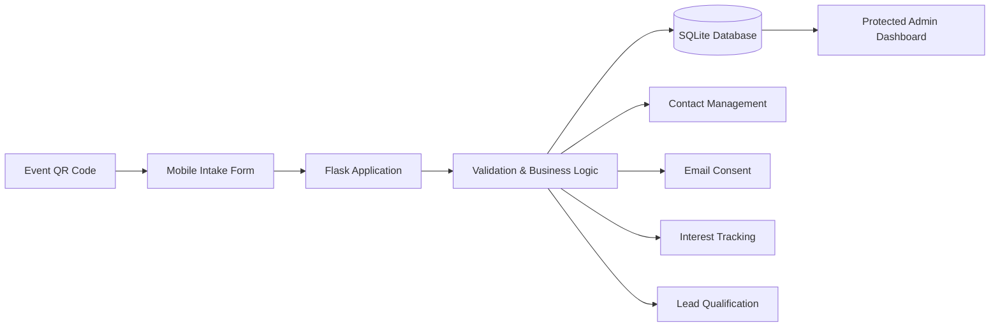
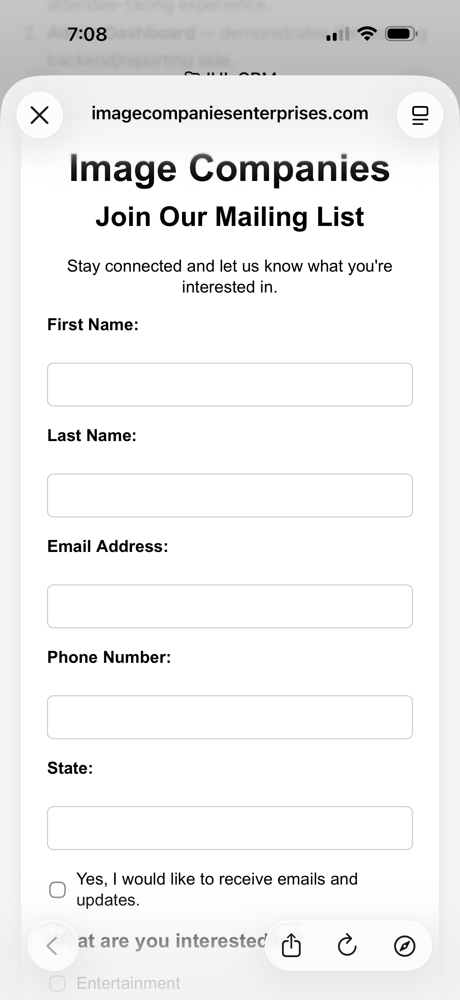
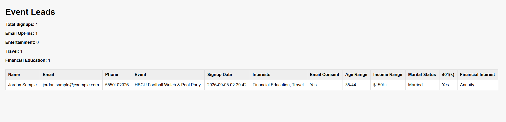

# Event Lead CRM


A production-deployed event lead capture and qualification system built with Flask, SQLite, HTML, and QR-code intake.

## Overview

Event Lead CRM was created to capture and organize leads at live events through an event-specific QR code and mobile web form.

The system allows users to:

- Submit contact information from a mobile device
- Opt in or out of email communication
- Select areas of interest
- Complete conditional qualification questions
- Associate each lead with a specific event
- Store lead data in SQLite
- Review leads through a password-protected admin dashboard

## Tech Stack

- Python
- Flask
- SQLite
- HTML
- Jinja
- Git
- GitHub
- GoDaddy cPanel deployment

## Business Problem

Live events often generate valuable leads, but collecting information through paper forms, generic signup tools, or disconnected spreadsheets can make follow-up and segmentation difficult.

Event Lead CRM was designed to create a streamlined lead-capture workflow that connects the event experience directly to a structured database.

Each event can use a unique QR-code link that identifies the source event automatically. Leads can provide their contact information, communication consent, interests, and relevant qualification information from their mobile device.

The resulting data is immediately available through a protected administrative dashboard, allowing event organizers to review leads and understand audience interests without manually transferring data between systems.

## Key Features

### Event-Specific Lead Capture
- Generates event-specific intake URLs for lead attribution
- Supports QR-code access for mobile lead capture
- Automatically associates each submission with its source event

### Contact & Consent Management
- Captures name, email address, phone number, and state
- Identifies existing contacts by email address
- Records email consent status and consent source
- Maintains consent history separately from the core contact record

### Interest-Based Qualification
- Captures interest in Entertainment, Travel, and Financial Education
- Dynamically displays qualification questions based on selected interests
- Collects age range, income range, and marital status for applicable leads
- Captures additional financial qualification information when Financial Education is selected

### Data Management
- Uses a relational SQLite database with linked contact, event, signup, interest, consent, and qualification data
- Prevents duplicate qualification records for the same contact and event
- Uses database transactions and rollback handling to protect data integrity
- Validates required fields and submitted values before database insertion

### Administrative Dashboard
- Password-protected administrative access
- Event-specific lead reporting
- Displays contact information, interests, consent, and qualification data
- Provides summary counts for total signups, email opt-ins, and interest categories

### Production Deployment
- Deployed as a live Flask application using GoDaddy cPanel and Passenger
- Uses environment variables for production configuration and administrative credentials
- Separates development and production database environments

## System Workflow

1. An event is created in the CRM database.
2. The event receives a unique event-specific intake URL.
3. A QR code directs attendees to the mobile lead capture form.
4. The attendee enters contact information and communication consent.
5. The attendee selects one or more areas of interest.
6. The form dynamically displays qualification questions based on the selected interests.
7. Flask validates the submitted information.
8. The application identifies an existing contact or creates a new contact.
9. The submission is associated with the appropriate event.
10. Interests, consent, and qualification data are stored in related SQLite tables.
11. Authorized users can review event-specific leads and summary statistics through the protected admin dashboard.

## Application Architecture



## Database Architecture

The application uses a relational SQLite database consisting of six core tables:

| Table | Purpose |
|---|---|
| `contacts` | Stores the primary contact record for each lead |
| `events` | Stores event information and unique event identifiers |
| `event_signups` | Connects contacts to the events they attended |
| `interests` | Stores each lead's selected areas of interest |
| `email_consents` | Maintains event-specific email consent records |
| `lead_qualifications` | Stores qualification data collected through conditional form questions |

### Data Relationships

A contact can participate in multiple events, while each event can contain multiple contacts. The `event_signups` table creates this relationship without duplicating the primary contact record.

Interest, consent, and qualification records are associated with both the contact and the applicable event, allowing the CRM to maintain event-specific lead history over time.

## Security & Data Protection

The application includes several safeguards for protecting lead and administrative data:

- Administrative dashboard access is protected with HTTP Basic Authentication.
- Administrative credentials are stored in environment variables rather than hard-coded into the application.
- Production and development databases can be configured separately using environment variables.
- Event IDs are validated before submissions are accepted.
- Submitted qualification values are validated before database storage.
- Database transactions include rollback handling to reduce the risk of incomplete or inconsistent records.
- Database files, environment files, and source contact data are excluded from Git version control through `.gitignore`.
- Personally identifiable lead information is not stored in the GitHub repository.

## Project Structure

```text
event-lead-crm/
│
├── app.py                    # Flask application and business logic
├── passenger_wsgi.py         # Production WSGI entry point
├── requirements.txt          # Core application dependencies
├── requirements-import.txt   # Optional Excel import dependencies
│
├── templates/
│   ├── intake_form.html      # Mobile lead capture form
│   ├── success.html          # Submission confirmation page
│   └── admin_leads.html      # Protected admin dashboard
│
├── scripts/
│   ├── contact_intake.py     # Command-line contact intake utility
│   └── import_seedlist.py    # Optional Excel seed-list import utility
│
├── sql/
│   ├── init_database.sql     # Relational database schema
│   └── ...                   # Database setup, validation, and test scripts
│
├── docs/
│   ├── mobile-intake-form.png
│   └── admin-dashboard.png
│
├── data/                     # Local source data (excluded from Git)
├── database/                 # Local development database (excluded from Git)
│
├── .env.example              # Example environment configuration
├── .gitignore                # Files excluded from version control
└── README.md                 # Project documentation
```
## Development & Deployment

The application was developed locally using Python, Flask, and SQLite, with Git used for version control and GitHub for source code management.

The production application is deployed through GoDaddy cPanel using:

- Python 3.11
- Passenger WSGI
- Flask
- SQLite
- Environment-based configuration

The application supports separate database paths for development and production environments through the `DATABASE_PATH` environment variable.

Administrative credentials are also configured through environment variables, allowing sensitive credentials to remain outside the source code.

### Production Workflow

```text
Local Development
       ↓
Git Version Control
       ↓
GitHub Repository
       ↓
GoDaddy cPanel
       ↓
Passenger WSGI
       ↓
Flask Application
       ↓
Production SQLite Database
```

## Future Enhancements

The current version focuses on reliable event-based lead capture, qualification, and administrative review. Potential future enhancements include:

- SMS consent and communication preferences
- Expanded email subscription status management
- Advanced event analytics and reporting
- Lead search, filtering, and segmentation
- Automated follow-up workflows
- Export functionality for reporting and marketing workflows
- Enhanced administrative user management
- Additional dashboard visualizations
- Integration with external email and CRM platforms

## Screenshots

### Mobile Event Intake

The mobile-responsive intake form allows event attendees to submit contact information, communication consent, interests, and qualification information directly from their phones.

<p align="center">
  
</p>

### Administrative Dashboard

The protected administrative dashboard provides event-specific lead details and summary metrics for signups, communication consent, and areas of interest.

<p align="center">
  
</p>

## Local Setup

### 1. Clone the Repository

```bash
git clone https://github.com/Safiya-star/event-lead-crm.git
cd event-lead-crm
```

### 2. Create and Activate a Virtual Environment

```bash
python -m venv venv
```

Windows:

```bash
venv\Scripts\activate
```

### 3. Install Dependencies

```bash
pip install -r requirements.txt
```

For the optional Excel seed-list import utility, install:

```bash
pip install -r requirements-import.txt

### 4. Configure Environment Variables

Create your own local environment variables using `.env.example` as a reference:

```text
ADMIN_USERNAME=your_admin_username
ADMIN_PASSWORD=your_admin_password
DATABASE_PATH=path/to/your/event_leads.db
```

Do not commit real credentials or production database paths to source control.

### 5. Initialize the Database

The application includes SQL schema files inside the `sql/` directory for creating the required SQLite tables.

### 6. Run the Application

```bash
python app.py
```

Then open the local application in your browser using an event-specific URL such as:

```text
http://127.0.0.1:5000/?event_id=1
```
